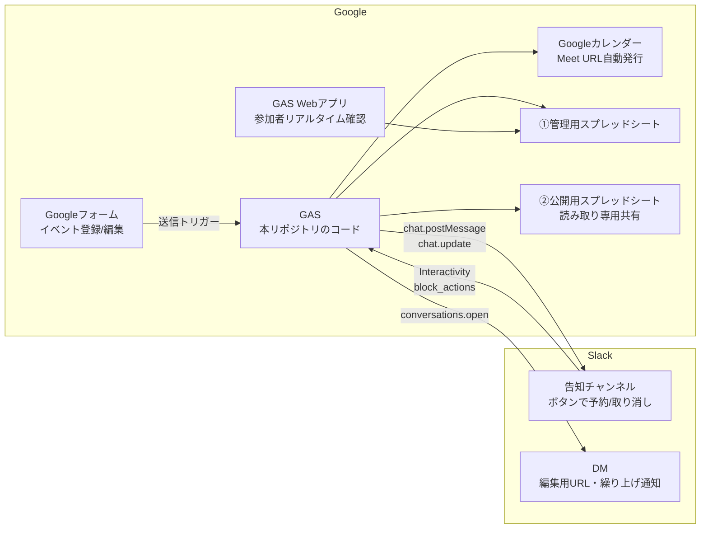

# コミュニティイベント自動予約・管理システム（Slack + GAS）

Googleフォーム・GAS（Google Apps Script）・Slack・Googleカレンダー・Googleスプレッドシートを連携し、コミュニティイベントの **告知・予約・定員管理・キャンセル待ち・変更・中止** を自動化するシステムです。

- 外部の有料連携ツール（Zapier等）は不要。**すべて各サービスの無料枠内**で完結します。
- Slackも**無料プランで動作**します。
- 主催者はフォームに入力するだけ、参加者はSlackのボタンを押すだけ。スプレッドシートを直接触る必要はありません。

## DATA Saber Bridge での利用について

本システムは、Tableauコミュニティの人材育成プログラム **[DATA Saber - Bridge](https://bridge.datasaber.world/)** のSlackワークスペースで、師匠・弟子が主催する勉強会やイベントを運営するために開発されました。そのため、コード・ドキュメント全体で次の用語を使っています。

| 用語 | 意味 |
|---|---|
| **師匠** | DATA Saber認定者としてメンターを務めるメンバー。師匠用フォームからイベントを登録します |
| **弟子** | DATA Saber認定を目指して修行中のメンバー。弟子用フォームからイベントを登録します |
| **師匠イベント** | 師匠用フォーム経由で登録されたイベント。弟子が勝手に変更・中止できないよう、編集用URLが公開されません |

もちろんDATA Saber Bridge専用というわけではなく、「運営側メンバー」と「一般メンバー」の2階層があるコミュニティなら（あるいは全員を弟子扱いにして1フォーム構成でも）そのまま使えます。師匠＝運営・管理者、弟子＝一般メンバー、と読み替えてください。

## 目次

1. [できること（システム概要）](#1-できることシステム概要)
2. [全体アーキテクチャ](#2-全体アーキテクチャ)
3. [前提条件と準備するもの](#3-前提条件と準備するもの)
4. [セットアップ手順](#4-セットアップ手順)
5. [環境変数（スクリプトプロパティ）一覧](#5-環境変数スクリプトプロパティ一覧)
6. [使い方・運用フロー](#6-使い方運用フロー)
7. [トラブルシューティング / FAQ](#7-トラブルシューティング--faq)
8. [リポジトリ構成](#8-リポジトリ構成)
9. [ライセンス・注意事項](#9-ライセンス注意事項)

## 1. できること（システム概要）

### 主催者（師匠・弟子）から見ると

- Slackで `/event` と打つと、自分専用のイベント登録フォームのリンクが届く（主催者IDは入力済み）。
- フォームを送信するだけで、以下がすべて自動で行われる。
  - Googleカレンダーへの予定作成（オンライン開催なら **Google Meet URLの自動発行** も）
  - Slack告知チャンネルへの **予約ボタン付き告知投稿**
  - スプレッドシートへの記録
  - 自分宛DMへの **回答編集用URL** の送付
- イベントの変更・中止も、DMで届いた編集用URLからフォームを再送信するだけ。告知・カレンダー・シートが一括更新される。

### 参加者（メンバー）から見ると

- Slackの告知メッセージの「✋ 参加する」ボタンを押すだけで参加登録。「取り消す」ボタンでキャンセル。
- 告知メッセージ本文に **参加者名と残枠がリアルタイムで再描画** され、メッセージがそのまま出欠表になる。
- 満員になるとボタンが「🈵 キャンセル待ちに登録」に自動で切り替わり、空きが出ると **先着順で自動繰り上げ＋本人へDM通知**（早押し競争なしの公平なFIFO方式）。
- 師匠・主催者・運営スタッフは「🛡 運営として参加」ボタンから登録できる。**運営は定員にカウントされず**、満員でも参加でき、一般メンバーのキャンセル待ちにも影響しない。

### 運営・管理者から見ると

- 個人データはSlackユーザーIDと表示名の2項目のみ。メールアドレス・本名は収集しない設計。
- スプレッドシートは管理用（非公開）と公開用（閲覧専用ミラー）の2ファイル分離で、メンバーに安全に一覧を公開できる。
- 入力ミス・二重登録はGASが検知して主催者へDMで差し戻すので、「送信したのに告知が出ない」まま放置される事故が起きない。
- **運営（師匠・主催者・運営スタッフ）は定員の枠外**。「🛡 運営として参加」で登録すれば、定員は一般メンバーのぶんだけを消費する。誰が運営として参加するかは出欠表（告知メッセージ・参加者確認ページ・スプレッドシート）に「運営」として別枠で表示される。

## 2. 全体アーキテクチャ



### データ構造（スプレッドシート）

スプレッドシートは **2ファイル分離構造** です。

- **①管理用**（非公開・GASが読み書き）
- **②公開用**（①のミラー。メンバーへは読み取り専用で共有）

各ファイルに以下の2シートを持ちます（シートは初期化時に自動作成されます）。

| シート | 列構成 |
|---|---|
| イベントマスター | イベントID / 回答ID / イベント名 / 主催者SlackユーザーID / 開始日時 / 終了日時 / 定員 / ステータス / 開催形式 / 会場URL・開催場所 / 概要 / 事前準備 / カレンダーイベントID / SlackチャンネルID / SlackメッセージTS / 回答編集用URL / 登録日時 / 更新日時 / 種別（師匠・弟子） / 詳細スレッドTS |
| 参加者リスト | イベントID / SlackユーザーID / 表示名 / 状態（参加・キャンセル待ち・運営） / 登録日時（1人=1行の縦持ち。取り消しで行削除、繰り上げで状態を更新。「運営」は定員・キャンセル待ちの対象外） |

**同期のタイミング:**

- イベントマスターは管理用・公開用の**両方へ即時反映**されます。
- 参加者リストは、ボタン応答を高速に保つため**管理用のみリアルタイム**で書き込み、**公開用へは5分毎の時間トリガーで自動同期**します（変更がないときは即終了。全行上書きのため、途中で失敗しても次回同期で必ず一致します）。リアルタイムの参加状況はSlack告知メッセージと参加者確認Webページで確認できます。

**編集用URLの公開について（意図的な設計）:**
②公開用にも「回答編集用URL」を含む全列をミラーします。主催者がDMを紛失しても、公開シートから自分のイベントの編集用URLを参照できるようにするための、**メンバーの善意を前提とした意図的な設計**です。編集用URLは開くと誰でもそのイベントを変更・中止できてしまうため、リンクが外部へ共有されるおそれのある運用（リンクを知る全員に公開等）では、公開範囲をワークスペースのメンバー限定にしてください。

**例外（師匠イベント）:**
師匠用フォーム（`MASTER_FORM_ID`）経由で登録されたイベントは「師匠イベント」（種別=師匠）として扱われ、②公開用へのミラー時に**回答編集用URL列のみ空欄**になります（弟子による師匠イベントの変更・中止を防ぐため）。管理用①には全列が記録されます。種別の判定は**どちらのフォームから登録されたかのみ**で決まります（師匠が弟子用フォームから登録すれば弟子イベント扱いです）。

### 個人情報保護

- Googleフォームの「メールアドレスを収集する」は**必ずオフ**にしてください。
- 本システムが蓄積する個人データは **SlackユーザーID** と **Slack表示名（Display Name）** の2項目のみです。メールアドレス・連絡先は収集しません。
- ただし、**表示名が未設定のメンバーについては、代替としてSlackプロフィールの氏名（Full Name）が記録されます**（表示名 → 氏名 → アカウント名 → ユーザーIDの順で代替）。本名を出したくないメンバーには表示名の設定を案内してください（3章参照）。

## 3. 前提条件と準備するもの

### 管理者（構築する人）が準備するもの

| 準備するもの | 補足 |
|---|---|
| Googleアカウント | 無料アカウントでOK。フォーム・スプレッドシート・カレンダー・GASを使います |
| Slackワークスペース | **無料プランで動作可**。Slack Appを作成できる権限が必要です |
| （任意）[clasp](https://github.com/google/clasp) | ローカルでコードを管理したい場合。GASエディタへのコピー&ペーストだけでも構築できます |

セットアップの所要時間は、慣れていない方でも1〜2時間程度が目安です。手順どおりに上から進めれば完成します。

### メンバー（参加者・主催者）へ事前に案内すること

運用開始時に、ワークスペースのメンバーへ以下をアナウンスしておくとスムーズです。

| 案内すること | 理由 |
|---|---|
| **Slackプロフィールの「表示名（Display Name）」を設定する** | 参加ボタンを押すと表示名が出欠表（告知メッセージ・スプレッドシート）に載ります。**表示名が未設定の場合は代わりにプロフィールの氏名（Full Name）が載る**ため、本名を出したくない方は必ず設定してください |
| 告知チャンネルに参加する | 告知・予約はすべて告知チャンネル上で行われます |
| 通知（DM）を受け取れる状態にしておく | 参加確認・キャンセル待ちの繰り上げ・編集用URLの送付はBotからのDMで届きます。**BotのDMは通常のDM欄ではなく、サイドバーの「App」欄（アプリ名の会話）に届きます**。見当たらない場合はSlack内検索でアプリ名を探してください。アプリからのDMをミュートしていると気付けません |

なお、表示名の変更はプロフィールから各自でいつでも行えます。表示名を変更しても、変更後に押したボタンから新しい表示名が使われます（反映は最大6時間キャッシュ分だけ遅れることがあります）。

## 4. セットアップ手順

作業の流れは次のとおりです。

1. スプレッドシートを2つ作る（→ 4-1）
2. Googleフォームを作る（→ 4-2）
3. カレンダーを用意する（→ 4-3）
4. GASプロジェクトにコードを入れる（→ 4-4）
5. Slack Appを作る（→ 4-5）
6. GASをWebアプリとして公開し、Slackと接続する（→ 4-6）
7. スクリプトプロパティを登録し、初期化関数を実行する（→ 4-7）

### 4-1. スプレッドシートの準備

1. スプレッドシートを **2ファイル** 作成します（例:「イベント管理（管理用）」「イベント一覧（公開用）」）。
2. それぞれのURLから **スプレッドシートID** を控えます。IDはURLの `/d/` と `/edit` の間の文字列です。
   ```
   https://docs.google.com/spreadsheets/d/【この部分がID】/edit
   ```
3. 公開用は「リンクを知っている全員: 閲覧者」またはメンバーへ閲覧権限のみで共有します。**管理用は共有しません。**
4. シート（タブ）の作成は不要です。後述の `setupTriggers()` 実行時に自動で作成されます（手動で作る場合は前章の列構成・シート名に合わせてください）。

### 4-2. Googleフォームの作成（弟子用・師匠用の2フォーム構成）

フォームは2つ作成します。

- **弟子用フォーム（必須）:** 弟子主催のイベント登録用。`/event` コマンドで全員に案内されるのはこちらです。
- **師匠用フォーム（任意）:** 師匠主催のイベント登録用。弟子用フォームの「コピーを作成」で複製するのが確実です。**URLは師匠以外に共有しないでください**（このフォーム経由のイベントは師匠イベントとして扱われ、公開用シートに編集用URLが載りません）。師匠・弟子の区別が不要なコミュニティでは、弟子用フォーム1つだけで運用できます。

いずれのフォームも、**設問タイトルを下表と完全一致**させて作成してください（GASはタイトル文字列で回答を照合するため、1文字でも違うと動きません）。

| # | 設問タイトル | 形式 | 必須 |
|---|---|---|---|
| 1 | イベント名 | 記述式（短文） | ✓ |
| 2 | 主催者のSlackユーザーID | 記述式（短文） | ✓ |
| 3 | 開始日時 | 日付（**「時刻を含める」をオン**） | ✓ |
| 4 | 終了時刻 | 時刻 | ✓ |
| 5 | 定員 | 記述式（回答の検証: 数値） | ✓ |
| 6 | イベントのステータス | ラジオボタン「①開催 / ②中止」 | ✓ |
| 7 | 開催形式 | ラジオボタン「①オンライン・自動発行 / ②オンライン・手動URL / ③オフライン・対面」 | ✓ |
| 8 | 会場URL または 開催場所 | 記述式（①の場合は空欄可） | － |
| 9 | 概要・対象者 | 段落 | ✓ |
| 10 | 事前準備・持ち物・資料リンク | 段落 | － |

フォームの設定（画面上部の「設定」タブ）で、以下を必ず行ってください。

| 設定項目 | 値 | 理由 |
|---|---|---|
| メールアドレスを収集する | **オフ** | 個人情報保護仕様のため |
| 回答を1回に制限する | **オフ** | オンだと編集URLの挙動が変わるため |
| 回答の編集を許可する | **オン** | 変更・中止フローに必須のため |

最後に、フォームURLの `/d/` と `/edit` の間の **フォームID** を控えます（弟子用・師匠用それぞれ）。

### 4-3. Googleカレンダーの準備

1. イベント用のカレンダーを新規作成します（既存カレンダーでも構いません）。
2. カレンダー設定 →「カレンダーの統合」から **カレンダーID** を控えます。
3. メンバーに公開したい場合は「予定の表示（すべての予定の詳細）」権限で共有するか、一般公開します。

### 4-4. GASプロジェクトの作成

1. [script.google.com](https://script.google.com) で新規プロジェクトを作成します（スタンドアロン型。スプレッドシートからではなくトップページから作成してください）。
2. `src/` 配下の各 `.gs` ファイルの内容をすべてコピーして貼り付けます（ファイル名も合わせると後の管理が楽です）。
3. `appsscript.json` を反映するため、「プロジェクトの設定」→「appsscript.json マニフェスト ファイルをエディタで表示する」をオンにし、本リポジトリの `src/appsscript.json` の内容で置き換えます。
4. エディタ左の「サービス +」に **Google Calendar API（拡張サービス）** が表示されていることを確認します（マニフェスト反映済みなら自動で有効になっています）。

### 4-5. Slack Appの作成

1. [api.slack.com/apps](https://api.slack.com/apps) →「Create New App」→「From scratch」でアプリを作成し、ワークスペースにインストールします。
2. **OAuth & Permissions → Bot Token Scopes** に以下の4つを追加します。

   | Scope | 用途 |
   |---|---|
   | `chat:write` | ボタン付き告知の投稿・参加状況のリアルタイム再描画・スレッド通知 |
   | `users:read` | 表示名（Display Name）の取得 |
   | `im:write` | 主催者への編集URL通知・繰り上げ確定のDM送信 |
   | `channels:history` | 告知メッセージのパーマリンク取得 |

3. スコープ追加後に再インストールし、表示される **Bot User OAuth Token（`xoxb-` で始まる文字列）** を控えます。
4. 告知チャンネルにBotを招待します（チャンネルで `/invite @アプリ名`）。**招待を忘れると告知が投稿できません。**
5. チャンネルIDを控えます（チャンネル名を右クリック →「リンクをコピー」→ URL末尾の `C` で始まる文字列）。

### 4-6. GAS Webアプリのデプロイ と Slackとの接続

1. GASエディタ右上「デプロイ」→「新しいデプロイ」→ 種類「**ウェブアプリ**」を選び、以下で設定します。
   - 次のユーザーとして実行: **自分**
   - アクセスできるユーザー: **全員**
2. 発行された `https://script.google.com/macros/s/…/exec` のURLを控えます（後述の `WEBAPP_URL` にも登録します）。
3. Slack App の **Interactivity & Shortcuts** を開き、
   - Interactivity を **On**
   - Request URL に上記 `/exec` URL を入力 → Save Changes
   - （Event Subscriptions の設定は不要です。ボタン押下は Interactivity 経由で届きます）
4. Slack App の **Slash Commands** →「Create New Command」で、イベント登録用コマンドを作成します。
   - Command: `/event`（任意の名前で可）
   - Request URL: 上記と同じ `/exec` URL
   - Short Description: 「イベント登録フォームを開く（主催者ID入力済み）」
   - 保存するとアプリに `commands` スコープが追加されるため、**アプリを再インストール**します（トークンは変わりません）。
5. 以後コードを修正した場合は、「デプロイを管理」から**既存デプロイの新バージョン**として更新してください。「新しいデプロイ」を作るとURLが変わってしまい、Slack側の設定し直しが必要になります。

> **署名検証についての注記:** GASのWebアプリはHTTPリクエストヘッダーを参照できないため、`X-Slack-Signature` ヘッダーと `SLACK_SIGNING_SECRET` によるHMAC署名検証は実装できません。本システムでは代替として、Slack App の Basic Information にある **Verification Token** をペイロードの `token` と照合する簡易検証を行います（`SLACK_VERIFICATION_TOKEN` 未設定時は検証をスキップします）。
>
> **応答速度についての注記:** Slackはボタン押下への応答を3秒以内に求めます。GASのコールドスタート時はまれに超過し、押した本人に「応答に失敗した」旨の警告が表示されることがありますが、**処理自体は正常に完了しており**、メッセージの再描画で結果を確認できます。

### 4-7. スクリプトプロパティの登録と初期化

1. 次章の表に従って、スクリプトプロパティをすべて登録します。
2. GASエディタで `setupTriggers` 関数を選択して**手動で1回実行**します（初回は権限承認ダイアログが表示されるので許可してください）。この実行で以下が自動で行われます。
   - フォーム送信トリガー・公開用シート定期同期トリガー（5分毎）の登録
   - 両スプレッドシートへのシート自動作成
   - フォームの「開催形式」「会場URL または 開催場所」の設問への入力ヒント設定（無料版Meetの60分制限と予定分割の説明）
3. 続けて `setupPrefillEntryIds` 関数（SlashCommand.gs）も**手動で1回実行**します。
   - `/event` コマンドの事前入力URLを高速に組み立てるための**フォームのエントリID**（`FORM_ENTRY_ORGANIZER` など）が自動でスクリプトプロパティに登録されます。
   - 未実行でも `/event` は動作しますが、リンクが**事前入力なしの素のフォームURL**になります。
   - フォームの設問を作り直してエントリIDが変わった場合は、この関数を再実行してください（`MASTER_FORM_ID` を後から登録した場合も再実行が必要です）。

以上でセットアップは完了です。Slackで `/event` を打ってフォームリンクが返ってくれば成功です。テスト登録をして、告知投稿 → ボタンで参加 → 取り消し → 編集URLで中止、まで一巡確認することをおすすめします。

## 5. 環境変数（スクリプトプロパティ）一覧

ソースコード内にトークンやIDはハードコードしていません。設定値はすべてGASの「スクリプト プロパティ」で管理します。プロパティは**手動で登録するもの**と、**初期化関数の実行で自動登録されるもの**の2種類に分かれます。

### 手動で登録するもの

GASエディタの **「プロジェクトの設定」→「スクリプト プロパティ」→「スクリプト プロパティを追加」** から、以下のキーを実際の値で登録してください。

| プロパティ名 | 設定する値 | 必須 |
|---|---|---|
| `SLACK_BOT_TOKEN` | Bot User OAuth Token（`xoxb-…`）※コード上のダミー: `YOUR_SLACK_BOT_TOKEN` | ✓ |
| `SLACK_VERIFICATION_TOKEN` | Slack App の Basic Information → Verification Token | 推奨 |
| `SLACK_SIGNING_SECRET` | Slack App の Signing Secret ※GASの制約により現状未使用（前章の注記参照）。将来の移行に備えて登録可 | － |
| `MANAGEMENT_SPREADSHEET_ID` | ①管理用スプレッドシートのID | ✓ |
| `PUBLIC_SPREADSHEET_ID` | ②公開用スプレッドシートのID | ✓ |
| `GOOGLE_CALENDAR_ID` | イベント用カレンダーのID | ✓ |
| `SLACK_CHANNEL_ID` | 告知チャンネルのID（`C…`） | ✓ |
| `GOOGLE_FORM_ID` | 弟子用イベント登録フォームのID | ✓ |
| `MASTER_FORM_ID` | 師匠用フォームのID。このフォーム経由のイベントは師匠イベント扱いとなり、公開用シートに編集用URLを載せない。**登録後に `setupTriggers()` を再実行すること** | 任意 |
| `WEBAPP_URL` | WebアプリのURL（`…/exec`） | 推奨※1 |
| `MASTER_SLACK_USER_IDS` | 師匠のSlackユーザーID（カンマ区切りで複数可。例: `U11111,U22222`）。登録者が `/event` を打つと師匠用フォームのリンクだけが返る。種別の判定には使わない | 任意 |

※1 `WEBAPP_URL` は、告知メッセージ・カレンダー説明欄に載せる**参加者確認ページのURLを組み立てるためだけ**に使われます（Slackとの接続はSlack App側に設定したRequest URLで行われるため、このプロパティとは無関係です）。未登録でもGASがデプロイ済みURLの自動取得を試み、それにも失敗した場合は参加者確認URLの掲載が省略されるだけで、予約・キャンセル・告知などの本体機能には影響しません。ただし自動取得は実行コンテキストによって安定版の `/exec` 以外のURLを返すことがあるため、明示的な登録を推奨します。

### `setupPrefillEntryIds()` の実行で自動登録されるもの

以下のエントリID系プロパティは、手動で登録する必要はありません。4-7章の手順どおり **`setupPrefillEntryIds()` を1回実行すると、フォームから自動取得されて登録されます**（手動登録する場合は `entry.123456` の数値部分。`entry.` 付きでも可）。

| プロパティ名 | 自動登録される値 |
|---|---|
| `FORM_ENTRY_ORGANIZER` | 弟子用フォーム「主催者のSlackユーザーID」設問のエントリID |
| `FORM_ENTRY_STATUS` | 弟子用フォーム「イベントのステータス」設問のエントリID |
| `FORM_STATUS_OPEN_VALUE` | ステータス設問の「開催」を表す選択肢の文字列（フォームの選択肢と完全一致） |
| `MASTER_FORM_ENTRY_ORGANIZER` | 師匠用フォームの「主催者のSlackユーザーID」設問のエントリID（`MASTER_FORM_ID` 登録時のみ） |
| `MASTER_FORM_ENTRY_STATUS` | 師匠用フォームの「イベントのステータス」設問のエントリID（同上） |

これらが未設定でも `/event` は動作しますが、リンクが事前入力なしの素のフォームURLになります。Slackの3秒ルール対策として、`/event` の応答経路では `FormApp` を使わず、これらの固定値との文字列結合だけで事前入力URLを組み立てています。フォームの設問を作り直した場合や `MASTER_FORM_ID` を後から登録した場合は、`setupPrefillEntryIds()` を再実行してください。

## 6. 使い方・運用フロー

### イベントの新規登録（主催者）

1. Slackの任意のチャンネルで **`/event`** と入力します → 本人にだけ見える返信で、**イベント登録フォームの「あなた専用リンク」**が届きます。
   - このリンクを開くと「主催者のSlackユーザーID」と「ステータス: ①開催」が**入力済み**の状態でフォームが表示されます（IDの手入力が不要になり、入力ミスを防げます）。
   - `MASTER_SLACK_USER_IDS` に登録された師匠が `/event` を打った場合は、**師匠用フォームのリンクだけが届きます**（弟子用フォームのリンクは表示されません）。登録されるイベントはすべて師匠イベント扱いになります。
   - ※フォームのURLを直接開いて手入力することも引き続き可能です。
2. 残りのイベント情報を入力・送信します。
3. 送信すると自動で以下が実行されます。
   - Googleカレンダーに予定を作成。開催形式が「①オンライン・自動発行」なら **Google Meet URLが自動発行**され告知・シートに反映。「②手動URL / ③オフライン」なら入力したURL・住所がカレンダーの場所欄に入ります。
   - Slackの告知チャンネルへ、**「✋ 参加する」「取り消す」ボタン付き**のイベント案内をBotが投稿。
   - 管理用・公開用スプレッドシートへイベントを記録。
   - カレンダーの説明欄に概要・事前準備・参加者確認URL・Slackパーマリンクを書き込み。
   - 主催者のSlackへ **回答編集用URL** がDMで届きます（変更・中止に必要なので保管してください）。
     - ※このDMは通常のDM欄ではなく、**サイドバーの「App」欄（Botアプリ名の会話）** に届きます。届いていないように見える場合は、まずSlack内検索でアプリ名を探してください。

### 60分を超えるオンラインイベント（無料版Meetの制限対策）

- 開催形式「①自動発行」で60分を超えるイベントの場合、**カレンダー予定は60分ごとに自動分割**されます（例: 2時間 → 「イベント名（1/2）」「イベント名（2/2）」）。
- これは無料版Google Meetで3人以上の通話が60分で切断されるための措置です。**Meet URLは全予定共通**なので、切断されたら同じURLで再入室すれば続行できます（告知メッセージ・カレンダー説明欄にも案内が自動掲載されます）。
- **進行のコツ:** Meetの60分カウントは「通話の接続開始」からのため、カレンダーの区切りとは厳密には一致しません。**予定の区切りの数分前に主催者が休憩を宣言して全員いったん退出 → 同じURLで再入室**すると、そこから60分がリセットされ、途中で突然切断されるのを防げます。

### 入力ミス・二重登録の自動ガード

フォーム送信時にGASが内容を検証し、問題があると**登録・更新を行わずに主催者へDMで理由と修正用リンクを通知**します。「送信したのに告知が出ない」まま気付かない事態を防ぎます。

- 検証項目: 開始日時が過去でないか / 定員が1以上の整数か / SlackユーザーIDの形式 / 開催形式②③での場所未入力 / 日時の形式
- **二重登録ガード:** 同じ主催者が同じ開始日時のイベントを既に持っている場合（＝「編集のつもりで新規送信」の典型パターン）は登録せず、既存イベントの編集用URLをDMで案内します。同名イベントでも開始日時が異なれば連続講座として通常どおり登録できます。
- 主催者のSlack IDが不正でDMを送れない場合のみ、告知チャンネルに「登録を受け付けられなかった」旨の案内が投稿されます。

### 参加登録・キャンセル（メンバー）

- 告知メッセージの **「✋ 参加する」ボタンを押す → 参加登録**（表示名が参加者リストに1行追記され、本人に確認通知が届きます）。
- **「取り消す」ボタンを押す → キャンセル**（該当行が自動削除され枠が開放されます）。
- **告知の本文には、イベント名・開催日時・場所・主催・概要（対象者）・参加状況・参加ボタンといった判断に必要な情報を載せ、事前準備・持ち物・資料リンクなどの詳細は同じメッセージの「スレッド」に投稿**します。本文が長くて目が泳ぐというフィードバックへの対応です。概要は「内容が分かってスレッドを開く気になる」よう本文の上部に必ず載せ、長い場合は先頭部分をプレビュー表示して続きをスレッドに回します。概要が短く事前準備も無いイベントは本文1通で完結し、スレッドは作りません。詳細を更新（回答編集）するとスレッド側の投稿も自動で最新化されます。
- 操作のたびに告知メッセージ本文が再描画され、**「参加 8/10名（残り2枠）」と参加者名が常に最新表示**されます。メッセージがそのまま出欠表として機能します。
- **満員時はキャンセル待ちに自動切り替え:** ボタンが「🈵 キャンセル待ちに登録」に変わり、押すと先着順で待ち行列に登録されます。空きが出ると**待ちの先頭が自動で参加に繰り上がり、本人へDMで通知**されます（早押し競争のない公平なFIFO方式）。
- キャンセル待ちが誰もいない状態で満員から空きが出たときのみ、告知メッセージの**スレッドに「空き枠が出ました（残りX枠）」が自動投稿**されます。
- **運営として参加（師匠・主催者・運営スタッフ向け）:** 「🛡 運営として参加」ボタンを押すと **状態「運営」** で登録され、**定員にカウントされません**（満員でも登録可・キャンセル待ちにも入りません）。出欠表には一般参加者とは別枠で「運営 N名（定員外）」と表示されます。すでに「参加」で登録済みの人がこのボタンを押すと運営へ切り替わり、空いた1枠へキャンセル待ちが繰り上がります。運営を辞めるときも「取り消す」でキャンセルできます。誰を運営とするかはリストで管理せず、本人がこのボタンで自己申告する方式です。
- イベント終了時刻を過ぎたイベントへのボタン操作は、一切処理されません（ガードレール）。
- 告知直後などに操作が集中した場合、「ただいま操作が混み合っています」と案内されることがあります。**数秒おいてもう一度押せば正しく処理**されます（同時押下で定員を超えることはありません）。

### 参加者のリアルタイム確認

- 告知メッセージ・カレンダー説明欄内のURL（`…/exec?eventId=EV_XXX`）を開くと、現在の参加者一覧（表示名）と残枠がブラウザで確認できます。

### イベントの変更・中止（主催者）

1. DMで受け取った **回答編集用URL** を開き、内容を修正して再送信します。
2. **ステータス「開催」のまま変更した場合:** スプレッドシート・カレンダー・Slack告知が最新情報に一括更新されます。
   - 日時・開催形式を変更した場合はカレンダー予定を作り直します（分割数の変化に追随）。**①自動発行の場合はMeet URLが再発行される**ため、参加者には告知メッセージの最新URLを案内してください（主催者へはDMで注意喚起されます）。
   - **開催日時（開始・終了）を変更した場合は、告知スレッドへ変更前後の日時を記したお知らせを投稿し、参加者・キャンセル待ちの各人へ個別にDMでも通知します**（Slackはメッセージ編集ではプッシュ通知を出さないため、告知の再描画だけでは参加者が気づけないのを補うためです）。
   - 定員を現在の参加者数より減らした場合、既存の参加者はそのまま維持され、参加者数が新定員を下回るまで**新規の申込はキャンセル待ち扱い**になります。
   - 定員を増やした場合、**空いた枠の分だけキャンセル待ちが先着順で自動繰り上げ**され、本人へDMで通知されます。
3. **ステータスを「②中止」に変更した場合:** カレンダーから予定が削除され、Slack告知が**【中止】表示に再描画（ボタンは消えます）**され、スレッドでメンバーへ通知されます。以降のボタン操作は処理されません。

## 7. トラブルシューティング / FAQ

**Q. フォームを送信したのにSlackに告知が投稿されない**
次の順で確認してください。
1. 主催者へDMが届いていないか（入力ミスで差し戻されている場合、理由と修正リンクがDMで届きます）。
2. `setupTriggers()` を実行済みか（フォーム送信トリガーが未登録だとGASが起動しません）。
3. Botが告知チャンネルに招待されているか（`/invite @アプリ名`）。
4. スクリプトプロパティの `SLACK_BOT_TOKEN`・`SLACK_CHANNEL_ID`・フォームIDに誤りがないか。
5. GASエディタの「実行数」でエラーログを確認。

**Q. ボタンを押したら「応答に失敗した」と警告が出た**
GASのコールドスタートで3秒ルールを超過したときに出ますが、**処理自体は完了しています**。告知メッセージの再描画で結果を確認してください（4-6章の注記参照）。

**Q. `/event` のリンクを開いても主催者IDが入力済みにならない**
`setupPrefillEntryIds()` が未実行か、フォームの設問を作り直してエントリIDが変わっています。`setupPrefillEntryIds()` を（再）実行してください。

**Q. 編集用URLなどのDMが届かない**
まず **サイドバーの「App」欄** を確認してください。BotからのDMは通常のDM欄ではなくApp欄（Botアプリ名の会話）に届くため、見落としやすいです（App欄に表示されていない場合は、Slack内検索でアプリ名を探すと会話が見つかります）。それでも届いていない場合は、GASエディタの「実行数」でログを確認してください。`Slack API error: conversations.open -> missing_scope` なら `im:write` スコープの追加漏れ（追加後のアプリ再インストール漏れ）、`user_not_found` なら主催者のSlackユーザーIDの誤りです。

**Q. 主催者が編集用URLのDMを紛失した**
公開用スプレッドシートのイベントマスターに編集用URL列があるので、そこから参照できます（師匠イベントは公開シートに載らないため、管理者が管理用シートから該当URLを渡してください）。

**Q. コードを修正したら動かなくなった**
「新しいデプロイ」を作るとWebアプリのURLが変わり、SlackのRequest URLと不一致になります。「デプロイを管理」から**既存デプロイの新バージョン**として更新してください。

**Q. 師匠・弟子の区別が不要なコミュニティでも使える?**
使えます。師匠用フォームと `MASTER_FORM_ID`・`MASTER_SLACK_USER_IDS` を設定しなければ、全イベントが弟子イベント（通常イベント）として扱われる1フォーム構成になります。

**Q. 公開シートの参加者リストが最新でない**
仕様です。公開用への参加者リスト同期は5分毎のため、最大5分の遅延があります。リアルタイムの状況はSlack告知メッセージまたは参加者確認Webページで確認してください。

## 8. リポジトリ構成

```
.
├── README.md
└── src/
    ├── appsscript.json      # GASマニフェスト（タイムゾーン・Calendar API・Webアプリ設定）
    ├── Config.gs            # スクリプトプロパティ読み込み・定数定義
    ├── Repository.gs        # スプレッドシート読み書き（管理用・公開用ミラーリング）
    ├── FormHandler.gs       # フォーム送信処理（新規登録・変更・中止）
    ├── SlackApi.gs          # Slack Web API ヘルパー
    ├── SlashCommand.gs      # /event コマンド（主催者ID入力済みフォームURLの発行）
    ├── Blocks.gs            # 告知メッセージ（Block Kit）の組み立て・再描画
    ├── InteractionHandler.gs # ボタン押下の受信（予約・キャンセル・定員管理・繰り上げ）
    ├── CalendarService.gs   # カレンダー連携（Meet自動発行含む）
    └── WebApp.gs            # 参加者リアルタイム確認ページ（doGet）
```

## 9. ライセンス・注意事項

- 本コードはパブリックリポジトリでの公開を前提に、**秘匿情報を一切含まない**構成になっています。フォークして利用する際も、トークン・IDは必ずスクリプトプロパティで管理してください。
- GAS無料枠のクォータ（UrlFetch 20,000回/日、トリガー実行90分/日 など）の範囲内で動作します。大規模ワークスペースで利用する場合はクォータにご注意ください。
- 本システムは有志による開発物であり、DATA Saber Bridge運営およびTableau/Salesforce社の公式ツールではありません。
