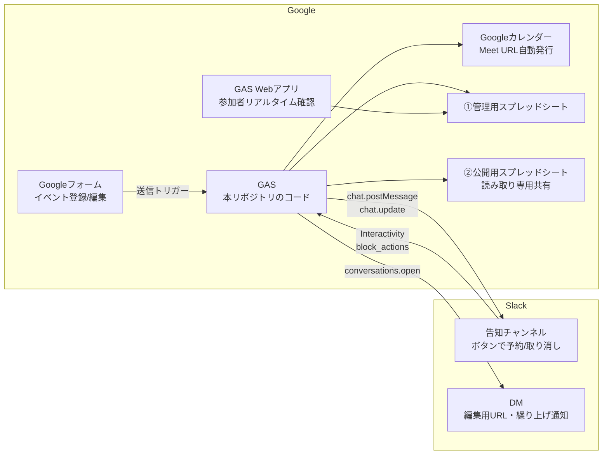

# コミュニティイベント自動予約・管理システム（Slack + GAS）

Googleフォーム・GAS（Google Apps Script）・Slack・Googleカレンダー・Googleスプレッドシートを連携し、イベントの告知・予約・定員管理・キャンセル処理を自動化するシステムです。外部の有料連携ツールは使わず、各サービスの無料枠内で完結します。

## 1. システム概要

- 主催者がGoogleフォームでイベントを登録すると、カレンダー予定の作成（オンライン形式ならGoogle Meet URLの自動発行）・Slackへの告知投稿・スプレッドシートへの記録が自動で行われます。
- メンバーはSlackの告知メッセージの「✋ 参加する」ボタンを押すだけで参加登録、「取り消す」ボタンでキャンセルできます。告知メッセージ本文に参加者・残枠がリアルタイムで再描画され、満員時は自動でキャンセル待ち（先着順・自動繰り上げ）に切り替わります。
- 主催者はDMで届く「回答編集用URL」からフォームを再送信するだけで、イベントの変更・中止ができます。



### データ構造（スプレッドシート）

2ファイル分離構造です。①管理用（非公開・GASが読み書き）と、②公開用（①のミラー。メンバーへは読み取り専用で共有）。各ファイルに以下の2シートを持ちます。
なお、②公開用にも「回答編集用URL」を含む全列をミラーします。主催者がDMを紛失しても公開シートから自分のイベントの編集用URLを参照できるようにする、**メンバーの善意を前提とした意図的な設計**です。編集用URLは開くと誰でもそのイベントを変更・中止できるため、外部に共有されるおそれがある運用（リンクを知る全員に公開等）では、公開範囲をワークスペースのメンバー限定にしてください。

**例外（師匠イベント）:** 師匠用フォーム（`MASTER_FORM_ID`）経由で登録されたイベントは「師匠イベント」（種別=師匠）として扱い、②公開用へのミラー時に**回答編集用URL列のみ空欄**にします（弟子による師匠イベントの変更・中止を防ぐため）。管理用①には全列が記録されます。種別の判定は**どちらのフォームから登録されたかのみ**で決まります（師匠が弟子用フォームから登録すれば弟子イベント扱いです）。

| シート | 構造 |
|---|---|
| イベントマスター | イベントID / 回答ID / イベント名 / 主催者SlackユーザーID / 開始日時 / 終了日時 / 定員 / ステータス / 開催形式 / 会場URL・開催場所 / 概要 / 事前準備 / カレンダーイベントID / SlackチャンネルID / SlackメッセージTS / 回答編集用URL / 登録日時 / 更新日時 / 種別（師匠・弟子） |
| 参加者リスト | イベントID / SlackユーザーID / 表示名 / 状態（参加・キャンセル待ち） / 登録日時（1人=1行の縦持ち。取り消しで行削除、繰り上げで状態を更新） |

### 個人情報保護

- Googleフォームの「メールアドレスを収集する」は**必ずオフ**にしてください。
- 本システムが蓄積する個人データは **SlackユーザーID** と **Slack表示名（Display Name）** の2項目のみです。メールアドレス・本名・連絡先は収集しません。

## 2. 前提条件

- 無料のGoogleアカウント（フォーム・スプレッドシート・カレンダー・GASが使えること）
- Slackワークスペース（**無料プランで動作可**）と、Slack Appを作成できる権限
- （任意）ローカルで管理する場合は [clasp](https://github.com/google/clasp)。コピー&ペーストでの構築も可能です。

## 3. セットアップ手順

### 3-1. スプレッドシートの準備

1. スプレッドシートを **2ファイル** 作成する（例:「イベント管理（管理用）」「イベント一覧（公開用）」）。
2. それぞれのURLから スプレッドシートID（`/d/` と `/edit` の間の文字列）を控える。
3. 公開用は「リンクを知っている全員: 閲覧者」またはメンバーへ閲覧権限のみで共有する。管理用は共有しない。
4. シートの作成は後述の `setupTriggers()` 実行時に自動で行われます（手動で作る場合は上記の列構成・シート名で作成）。

### 3-2. Googleフォームの作成（弟子用・師匠用の2フォーム構成）

フォームは2つ作成します。

- **弟子用フォーム（必須）:** 弟子主催のイベント登録用。`/event` コマンドで全員に案内されるのはこちら。
- **師匠用フォーム（任意）:** 師匠主催のイベント登録用。弟子用フォームの「コピーを作成」で複製するのが確実です。**URLは師匠以外に共有しないでください**（このフォーム経由のイベントは師匠イベントとして扱われ、公開用シートに編集用URLが載りません）。

いずれのフォームも、**設問タイトルを下表と完全一致**させて作成します（GASはタイトル文字列で回答を照合します）。

| # | 設問タイトル | 形式 | 必須 |
|---|---|---|---|
| 1 | イベント名 | 記述式（短文） | ✓ |
| 2 | 主催者のSlackユーザーID | 記述式（短文） | ✓ |
| 3 | 開始日時 | 日付（時刻を含める） | ✓ |
| 4 | 終了時刻 | 時刻 | ✓ |
| 5 | 定員 | 記述式（回答の検証: 数値） | ✓ |
| 6 | イベントのステータス | ラジオボタン「①開催 / ②中止」 | ✓ |
| 7 | 開催形式 | ラジオボタン「①オンライン・自動発行 / ②オンライン・手動URL / ③オフライン・対面」 | ✓ |
| 8 | 会場URL または 開催場所 | 記述式（①の場合は空欄可） | － |
| 9 | 概要・対象者 | 段落 | ✓ |
| 10 | 事前準備・持ち物・資料リンク | 段落 | － |

フォームの設定で以下を必ず行ってください。

- 「メールアドレスを収集する」→ **オフ**（個人情報保護仕様）
- 「回答を1回に制限する」→ **オフ**（オンだと編集URLの挙動が変わるため）
- 「回答の編集を許可する」→ **オン**（変更・中止フローに必須）
- フォームURLの `/d/` と `/edit` の間の **フォームID** を控える（弟子用・師匠用それぞれ）。

### 3-3. Googleカレンダーの準備

1. イベント用のカレンダーを新規作成（既存カレンダーでも可）。
2. カレンダー設定 →「カレンダーの統合」から **カレンダーID** を控える。
3. メンバーに公開したい場合は「予定の表示（すべての予定の詳細）」権限で共有、または一般公開する。

### 3-4. GASプロジェクトの作成

1. [script.google.com](https://script.google.com) で新規プロジェクトを作成する（スタンドアロン）。
2. `src/` 配下の各 `.gs` ファイルの内容をすべてコピーして貼り付ける（ファイル名も合わせると管理しやすい）。
3. `appsscript.json` を反映するため、「プロジェクトの設定」→「appsscript.json マニフェスト ファイルをエディタで表示する」をオンにし、本リポジトリの `src/appsscript.json` の内容で置き換える。
4. エディタ左の「サービス +」から **Google Calendar API（拡張サービス）** が有効になっていることを確認する（マニフェスト反映済みなら自動で有効）。

### 3-5. Slack Appの作成

1. [api.slack.com/apps](https://api.slack.com/apps) →「Create New App」→「From scratch」でアプリを作成し、ワークスペースにインストールする。
2. **OAuth & Permissions → Bot Token Scopes** に以下を追加する。

   | Scope | 用途 |
   |---|---|
   | `chat:write` | ボタン付き告知の投稿・参加状況のリアルタイム再描画・スレッド通知 |
   | `users:read` | 表示名（Display Name）の取得 |
   | `im:write` | 主催者への編集URL通知・繰り上げ確定のDM送信 |
   | `channels:history` | 告知メッセージのパーマリンク取得 |

3. 再インストール後に表示される **Bot User OAuth Token（xoxb-…）** を控える。
4. 告知チャンネルにBotを招待し（`/invite @アプリ名`）、チャンネルIDを控える（チャンネル名を右クリック→リンクをコピー→URL末尾の `C…`）。

### 3-6. GAS Webアプリのデプロイ と Interactivity の設定

1. GASエディタ右上「デプロイ」→「新しいデプロイ」→ 種類「**ウェブアプリ**」。
   - 次のユーザーとして実行: **自分**
   - アクセスできるユーザー: **全員**
2. 発行された `https://script.google.com/macros/s/…/exec` のURLを控える（後述の `WEBAPP_URL` にも登録）。
3. Slack App の **Interactivity & Shortcuts** を開き、
   - Interactivity を **On**
   - Request URL に上記 `/exec` URL を入力 → Save Changes
   - （Event Subscriptions の設定は不要です。ボタン押下は Interactivity 経由で届きます）
4. Slack App の **Slash Commands** →「Create New Command」で、イベント登録用コマンドを作成する。
   - Command: `/event`（任意の名前で可）
   - Request URL: 上記と同じ `/exec` URL
   - Short Description: 「イベント登録フォームを開く（主催者ID入力済み）」
   - 保存するとアプリに `commands` スコープが追加されるため、**アプリを再インストール**する（トークンは変わりません）。
5. コードを修正した場合は「デプロイを管理」から**既存デプロイの新バージョン**として更新するとURLが変わりません。

> **署名検証についての注記:** GASのWebアプリはHTTPリクエストヘッダーを参照できないため、`X-Slack-Signature` ヘッダーと `SLACK_SIGNING_SECRET` によるHMAC署名検証は実装できません。本システムでは代替として、Slack App の Basic Information にある **Verification Token** をペイロードの `token` と照合する簡易検証を行います（`SLACK_VERIFICATION_TOKEN` 未設定時は検証をスキップ）。
>
> **応答速度についての注記:** Slackはボタン押下への応答を3秒以内に求めます。GASのコールドスタート時はまれに超過し、押した本人に「応答に失敗した」旨の警告が表示されることがありますが、**処理自体は正常に完了しており**、メッセージの再描画で結果を確認できます。

### 3-7. 初期化とフォームトリガーの登録

1. スクリプトプロパティ（次章）をすべて登録する。
2. GASエディタで `setupTriggers` 関数を選択して**手動で1回実行**する（初回は権限承認ダイアログが表示されるので許可する）。
   - フォーム送信トリガーの登録と、両スプレッドシートへのシート自動作成が行われます。
   - あわせて、フォームの「開催形式」「会場URL または 開催場所」の設問に**入力ヒント（無料版Meetの60分制限と予定分割の説明）が自動設定**されます。

## 4. 環境変数（スクリプトプロパティ）の設定方法

ソースコード内にトークンやIDはハードコードしていません。GASエディタの **「プロジェクトの設定」→「スクリプト プロパティ」→「スクリプト プロパティを追加」** から、以下のキーをダミー値ではなく実際の値で登録してください。

| プロパティ名 | 設定する値 | 必須 |
|---|---|---|
| `SLACK_BOT_TOKEN` | Bot User OAuth Token（`xoxb-…`）※コード上のダミー: `YOUR_SLACK_BOT_TOKEN` | ✓ |
| `SLACK_VERIFICATION_TOKEN` | Slack App の Basic Information → Verification Token | 推奨 |
| `SLACK_SIGNING_SECRET` | Slack App の Signing Secret ※GASの制約により現状未使用（上記注記参照）。将来の移行に備えて登録可 | － |
| `MANAGEMENT_SPREADSHEET_ID` | ①管理用スプレッドシートのID | ✓ |
| `PUBLIC_SPREADSHEET_ID` | ②公開用スプレッドシートのID | ✓ |
| `GOOGLE_CALENDAR_ID` | イベント用カレンダーのID | ✓ |
| `SLACK_CHANNEL_ID` | 告知チャンネルのID（`C…`） | ✓ |
| `GOOGLE_FORM_ID` | 弟子用イベント登録フォームのID | ✓ |
| `MASTER_FORM_ID` | 師匠用フォームのID。このフォーム経由のイベントは師匠イベント扱いとなり、公開用シートに編集用URLを載せない。**登録後に `setupTriggers()` を再実行すること** | 任意 |
| `WEBAPP_URL` | WebアプリのURL（`…/exec`） | 推奨 |
| `MASTER_SLACK_USER_IDS` | 師匠のSlackユーザーID（カンマ区切りで複数可。例: `U11111,U22222`）。登録者が `/event` を打つと師匠用フォームのリンクも返る。種別の判定には使わない | 任意 |

## 5. 使い方・運用フロー

### イベントの新規登録（主催者）

1. Slackの任意のチャンネルで **`/event`** と入力する → 本人にだけ見える返信で、**イベント登録フォームの「あなた専用リンク」**が届く。
   - このリンクを開くと「主催者のSlackユーザーID」と「ステータス: ①開催」が**入力済み**の状態でフォームが表示されます（IDの手入力が不要になり、入力ミスを防げます）。
   - `MASTER_SLACK_USER_IDS` に登録された師匠が `/event` を打った場合は、**師匠用フォームのリンクもあわせて届きます**。師匠イベントとして登録したい場合は必ず師匠用フォームを使ってください（弟子用フォームから登録すると弟子イベント扱いになります）。
   - ※フォームのURLを直接開いて手入力することも引き続き可能です。
2. 残りのイベント情報を入力・送信する。
3. 送信すると自動で以下が実行されます。
   - Googleカレンダーに予定を作成。開催形式が「①オンライン・自動発行」なら **Google Meet URLが自動発行**され告知・シートに反映。「②手動URL / ③オフライン」なら入力したURL・住所がカレンダーの場所欄に入る。
   - **①自動発行で60分を超えるイベントの場合、カレンダー予定は60分ごとに自動分割**されます（例: 2時間 → 「イベント名（1/2）」「イベント名（2/2）」）。無料版Google Meetは3人以上の通話が60分で切断されるための措置で、**Meet URLは全予定共通**です。切断されたら同じURLで再入室します（告知メッセージ・カレンダー説明欄にも案内が自動掲載されます）。
   - **60分超イベントの進行のコツ:** Meetの60分カウントは「通話の接続開始」からのため、カレンダーの区切りとは厳密には一致しません。**予定の区切りの数分前に主催者が休憩を宣言して全員いったん退出→同じURLで再入室**すると、そこから60分がリセットされ、途中で突然切断されるのを防げます。
   - Slackの告知チャンネルへ、**「✋ 参加する」「取り消す」ボタン付き**のイベント案内をBotが投稿。
   - 管理用・公開用スプレッドシートへイベントを記録。
   - カレンダーの説明欄に概要・事前準備・参加者確認URL・Slackパーマリンクを書き込み。
   - 主催者のSlackへ **回答編集用URL** がDMで届く（変更・中止に必要なので保管）。

### 入力ミス・二重登録の自動ガード

フォーム送信時、GASが内容を検証し、問題があると**登録・更新を行わずに主催者へDMで理由と修正用リンクを通知**します。「送信したのに告知が出ない」まま気付かない事態を防ぎます。

- 検証項目: 開始日時が過去でないか / 定員が1以上の整数か / SlackユーザーIDの形式 / 開催形式②③での場所未入力 / 日時の形式
- **二重登録ガード:** 同じ主催者が同じ開始日時のイベントを既に持っている場合（＝「編集のつもりで新規送信」の典型パターン）は登録せず、既存イベントの編集用URLをDMで案内します。同名イベントでも開始日時が異なれば連続講座として通常どおり登録できます。
- 主催者のSlack IDが不正でDMを送れない場合のみ、告知チャンネルに「登録を受け付けられなかった」旨の案内が投稿されます。

### 参加登録・キャンセル（メンバー）

- 告知メッセージの **「✋ 参加する」ボタンを押す → 参加登録**（表示名が参加者リストに1行追記され、本人に確認通知が届く）。
- **「取り消す」ボタンを押す → キャンセル**（該当行が自動削除され枠が開放）。
- 操作のたびに告知メッセージ本文が再描画され、**「参加 8/10名（残り2枠）」と参加者名が常に最新表示**されます。メッセージがそのまま出欠表として機能します。
- **満員時はキャンセル待ちに自動切り替え:** ボタンが「🈵 キャンセル待ちに登録」に変わり、押すと先着順で待ち行列に登録されます。空きが出ると**待ちの先頭が自動で参加に繰り上がり、本人へDMで通知**されます（早押し競争のない公平なFIFO方式）。
- キャンセル待ちが誰もいない状態で満員から空きが出たときのみ、告知メッセージの**スレッドに「空き枠が出ました（残りX枠）」が自動投稿**されます。
- イベント終了時刻を過ぎたイベントへのボタン操作は、一切処理されません（ガードレール）。

### 参加者のリアルタイム確認

- 告知メッセージ・カレンダー説明欄内のURL（`…/exec?eventId=EV_XXX`）を開くと、現在の参加者一覧（表示名）と残枠がブラウザで確認できます。

### イベントの変更・中止（主催者）

1. DMで受け取った **回答編集用URL** を開き、内容を修正して再送信する。
2. **ステータス「開催」のまま変更した場合:** スプレッドシート・カレンダー・Slack告知が最新情報に一括更新されます。
   - 日時・開催形式を変更した場合はカレンダー予定を作り直します（分割数の変化に追随）。**①自動発行の場合はMeet URLが再発行される**ため、参加者には告知メッセージの最新URLを案内してください（主催者へはDMで注意喚起されます）。
   - 定員を現在の参加者数より減らした場合、既存の参加者はそのまま維持され、参加者数が新定員を下回るまで**新規の申込はキャンセル待ち扱い**になります。
   - 定員を増やした場合、**空いた枠の分だけキャンセル待ちが先着順で自動繰り上げ**され、本人へDMで通知されます。
3. **ステータスを「②中止」に変更した場合:** カレンダーから予定が削除され、Slack告知が**【中止】表示に再描画（ボタンは消えます）**され、スレッドでメンバーへ通知。以降のボタン操作は処理されません。

## リポジトリ構成

```
.
├── README.md
└── src/
    ├── appsscript.json      # GASマニフェスト（タイムゾーン・Calendar API・Webアプリ設定）
    ├── Config.gs            # スクリプトプロパティ読み込み・定数定義
    ├── Repository.gs        # スプレッドシート読み書き（管理用・公開用ミラーリング）
    ├── FormHandler.gs       # フォーム送信処理（新規登録・変更・中止）
    ├── SlackApi.gs          # Slack Web API ヘルパー
    ├── SlashCommand.gs      # /event コマンド（主催者ID入力済みフォームURLの発行）
    ├── Blocks.gs            # 告知メッセージ（Block Kit）の組み立て・再描画
    ├── InteractionHandler.gs # ボタン押下の受信（予約・キャンセル・定員管理・繰り上げ）
    ├── CalendarService.gs   # カレンダー連携（Meet自動発行含む）
    └── WebApp.gs            # 参加者リアルタイム確認ページ（doGet）
```

## ライセンス・注意事項

- 本コードはパブリックリポジトリでの公開を前提に、**秘匿情報を一切含まない**構成になっています。フォークして利用する際も、トークン・IDは必ずスクリプトプロパティで管理してください。
- GAS無料枠のクォータ（UrlFetch 20,000回/日、トリガー実行90分/日 など）の範囲内で動作します。大規模ワークスペースで利用する場合はクォータにご注意ください。
