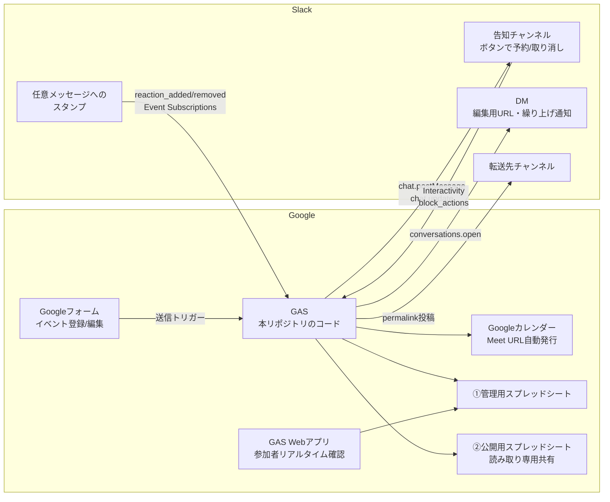

# コミュニティ運営サポートBot（Slack + GAS）

Slack と GAS（Google Apps Script）を軸に、**コミュニティ運営を Slack 上で支援する Bot** です。もともとはイベント管理のために作られましたが、運営で必要になった機能を足していける作りになっています。

現在の主な機能は次の2つです。

1. **イベント管理** — 告知・予約・定員管理・キャンセル待ち・変更・中止の自動化
2. **スタンプで別チャンネルへシェア** — 絵文字リアクションを起点にメッセージを転送

- 外部の有料連携ツール（Zapier等）は不要。**すべて各サービスの無料枠内**で完結します。
- Slackも**無料プランで動作**します。
- 主催者はフォームに入力するだけ、参加者はSlackのボタンを押すだけ。スプレッドシートを直接触る必要はありません。

## DATA Saber Bridge での利用について

本Botは、Tableauコミュニティの人材育成プログラム **[DATA Saber - Bridge](https://bridge.datasaber.world/)** のSlackワークスペースで、師匠・弟子が主催する勉強会やイベントの運営を支えるために開発されました。そのため、コード・ドキュメント全体で次の用語を使っています。

| 用語 | 意味 |
|---|---|
| **師匠** | DATA Saber認定者としてメンターを務めるメンバー。師匠用フォームからイベントを登録します |
| **弟子** | DATA Saber認定を目指して修行中のメンバー。弟子用フォームからイベントを登録します |
| **師匠イベント** | 師匠用フォーム経由で登録されたイベント。弟子が勝手に変更・中止できないよう、編集用URLが公開されません |

もちろんDATA Saber Bridge専用というわけではなく、「運営側メンバー」と「一般メンバー」の2階層があるコミュニティなら（あるいは全員を弟子扱いにして1フォーム構成でも）そのまま使えます。師匠＝運営・管理者、弟子＝一般メンバー、と読み替えてください。

## ドキュメント

用途に応じて、以下のドキュメントを参照してください。

| ドキュメント | 内容 | 主な読者 |
|---|---|---|
| 本 README | Botでできること・全体アーキテクチャ・リポジトリ構成 | すべての人 |
| [docs/SETUP.md](docs/SETUP.md) | 導入手順・前提条件・環境変数（スクリプトプロパティ）一覧 | 導入・運用する人 |
| [docs/OPERATIONS.md](docs/OPERATIONS.md) | 使い方・運用フロー・メンバーへの案内・トラブルシューティング / FAQ | 運用・利用する人 |
| [docs/DEVELOPMENT.md](docs/DEVELOPMENT.md) | 開発環境（clasp）・ブランチ運用・dev/prod デプロイ・コード構成 | Fork して継続開発する人 |

## できること

### 機能1: イベント管理

イベントの **告知・予約・定員管理・キャンセル待ち・変更・中止** を自動化します。

**主催者（師匠・弟子）から見ると**

- Slackで `/event` と打つと、自分専用のイベント登録フォームのリンクが届く（主催者IDは入力済み）。
- フォームを送信するだけで、以下がすべて自動で行われる。
  - Googleカレンダーへの予定作成（オンライン開催なら **Google Meet URLの自動発行** も）
  - Slack告知チャンネルへの **予約ボタン付き告知投稿**
  - スプレッドシートへの記録
  - 自分宛DMへの **回答編集用URL** の送付
- イベントの変更・中止も、DMで届いた編集用URLからフォームを再送信するだけ。告知・カレンダー・シートが一括更新される。

**参加者（メンバー）から見ると**

- Slackの告知メッセージの「✋ 参加する」ボタンを押すだけで参加登録。「取り消す」ボタンでキャンセル。
- 告知メッセージ本文に **参加者名と残枠がリアルタイムで再描画** され、メッセージがそのまま出欠表になる。
- 満員になるとボタンが「🈵 キャンセル待ちに登録」に自動で切り替わり、空きが出ると **先着順で自動繰り上げ＋本人へDM通知**（早押し競争なしの公平なFIFO方式）。
- 師匠・主催者・運営スタッフは「🛡 運営として参加」ボタンから登録できる。**運営は定員にカウントされず**、満員でも参加でき、一般メンバーのキャンセル待ちにも影響しない。

**運営・管理者から見ると**

- 個人データはSlackユーザーIDと表示名の2項目のみ。メールアドレス・本名は収集しない設計。
- スプレッドシートは管理用（非公開）と公開用（閲覧専用ミラー）の2ファイル分離で、メンバーに安全に一覧を公開できる。
- 入力ミス・二重登録はGASが検知して主催者へDMで差し戻すので、「送信したのに告知が出ない」まま放置される事故が起きない。
- **運営（師匠・主催者・運営スタッフ）は定員の枠外**。「🛡 運営として参加」で登録すれば、定員は一般メンバーのぶんだけを消費する。誰が運営として参加するかは出欠表（告知メッセージ・参加者確認ページ・スプレッドシート）に「運営」として別枠で表示される。

### 機能2: スタンプで別チャンネルへシェア

特定のスタンプ（絵文字リアクション）を押すと、そのメッセージを別チャンネルへ自動で転送します。「アーカイブに残す」「別チャンネルにも流す」といった運営作業を、ワンクリックで行えます。

- どの絵文字をどこへ流すかは、管理用スプレッドシートの「**絵文字転送マッピング**」シートで設定します。
- 転送されるのはメッセージのリンク（permalink）で、Slackの自動展開に任せるため、元メッセージの編集にも追従します。
- リアクションを外すと、転送先の投稿も自動で削除されます。

使い方の詳細は [docs/OPERATIONS.md](docs/OPERATIONS.md) を参照してください。

## 全体アーキテクチャ



図の下段（React → GAS → 転送先チャンネル）が機能2のスタンプ転送、それ以外が機能1のイベント管理の経路です。転送ルールは管理用スプレッドシート（SS1）で管理します。

### データ構造（スプレッドシート）

スプレッドシートは **2ファイル分離構造** です。

- **①管理用**（非公開・GASが読み書き）
- **②公開用**（①のミラー。メンバーへは読み取り専用で共有）

両ファイルに、イベント管理用の次の2シートを持ちます（初期化時に自動作成されます）。

| シート | 列構成 |
|---|---|
| イベントマスター | イベントID / 回答ID / イベント名 / 主催者SlackユーザーID / 開始日時 / 終了日時 / 定員 / ステータス / 開催形式 / 会場URL・開催場所 / 概要 / 事前準備 / カレンダーイベントID / SlackチャンネルID / SlackメッセージTS / 回答編集用URL / 登録日時 / 更新日時 / 種別（師匠・弟子） |
| 参加者リスト | イベントID / SlackユーザーID / 表示名 / 状態（参加・キャンセル待ち・運営） / 登録日時（1人=1行の縦持ち。取り消しで行削除、繰り上げで状態を更新。「運営」は定員・キャンセル待ちの対象外） |

加えて、運用設定・内部ログ用の次の3シートを **管理用①にのみ** 持ちます（イベントの参加状況とは無関係なため、公開用②へは同期しません）。

| シート | 役割 |
|---|---|
| 師匠リスト | 人が編集。`/event` で師匠用フォームのリンクを受け取るメンバーの一覧（SlackユーザーID / 表示名 / 有効 / メモ） |
| 絵文字転送マッピング | 人が編集。どの絵文字をどのチャンネルへ転送するかの対応表（絵文字名 / 転送先チャンネル / 有効 / メモ） |
| 絵文字転送ログ | システムが書く監査記録。二重転送の防止と、リアクション取り消し時の削除対象の特定に使う（行は削除しない） |

**同期のタイミング:**

- イベントマスターは管理用・公開用の**両方へ即時反映**されます。
- 参加者リストは、ボタン応答を高速に保つため**管理用のみリアルタイム**で書き込み、**公開用へは5分毎の時間トリガーで自動同期**します（変更がないときは即終了。全行上書きのため、途中で失敗しても次回同期で必ず一致します）。リアルタイムの参加状況はSlack告知メッセージと参加者確認Webページで確認できます。

**編集用URLの公開について（意図的な設計）:**
②公開用にも「回答編集用URL」を含む全列をミラーします。主催者がDMを紛失しても、公開シートから自分のイベントの編集用URLを参照できるようにするための、**メンバーの善意を前提とした意図的な設計**です。編集用URLは開くと誰でもそのイベントを変更・中止できてしまうため、リンクが外部へ共有されるおそれのある運用（リンクを知る全員に公開等）では、公開範囲をワークスペースのメンバー限定にしてください。

**例外（師匠イベント）:**
師匠用フォーム（`MASTER_FORM_ID`）経由で登録されたイベントは「師匠イベント」（種別=師匠）として扱われ、②公開用へのミラー時に**回答編集用URL列のみ空欄**になります（弟子による師匠イベントの変更・中止を防ぐため）。管理用①には全列が記録されます。種別の判定は**どちらのフォームから登録されたかのみ**で決まります（師匠が弟子用フォームから登録すれば弟子イベント扱いです）。

### 個人情報保護

- Googleフォームの「メールアドレスを収集する」は**必ずオフ**にしてください。
- 本Botが蓄積する個人データは **SlackユーザーID** と **Slack表示名（Display Name）** の2項目のみです。メールアドレス・連絡先は収集しません。
- ただし、**表示名が未設定のメンバーについては、代替としてSlackプロフィールの氏名（Full Name）が記録されます**（表示名 → 氏名 → アカウント名 → ユーザーIDの順で代替）。本名を出したくないメンバーには表示名の設定を案内してください（[docs/OPERATIONS.md](docs/OPERATIONS.md) の「メンバーへ事前に案内すること」参照）。

## リポジトリ構成

```
.
├── README.md               # Bot概要・アーキテクチャ・リポジトリ構成（本ファイル）
├── docs/
│   ├── SETUP.md            # 導入手順・前提条件・環境変数一覧（運用者向け）
│   ├── OPERATIONS.md       # 使い方・運用フロー・メンバー案内・FAQ
│   └── DEVELOPMENT.md      # 開発環境・ブランチ運用・dev/prodデプロイ（開発者向け）
├── .github/
│   └── workflows/
│       └── deploy.yml      # dev/prodマージ時に該当環境のGASへ自動デプロイ（clasp push + deploy）
├── slack/
│   └── manifest.yml        # Slack App構成の正（スコープ・/eventコマンド・Interactivity・Event Subscriptions）
└── src/
    ├── appsscript.json      # GASマニフェスト（タイムゾーン・Calendar API・Webアプリ設定）
    ├── Config.gs            # スクリプトプロパティ読み込み・定数定義
    ├── Bootstrap.gs         # 新インスタンス初期構築（スプシ・フォーム・カレンダー生成）
    ├── Repository.gs        # スプレッドシート読み書き（管理用・公開用ミラーリング）
    ├── FormHandler.gs       # フォーム送信処理（新規登録・変更・中止）
    ├── SlackApi.gs          # Slack Web API ヘルパー
    ├── SlashCommand.gs      # /event コマンド（主催者ID入力済みフォームURLの発行）
    ├── Blocks.gs            # 告知メッセージ（Block Kit）の組み立て・再描画
    ├── InteractionHandler.gs # ボタン押下・イベント受信の入口（予約・キャンセル・定員管理・繰り上げ）
    ├── CalendarService.gs   # カレンダー連携（Meet自動発行含む）
    ├── MasterList.gs        # 師匠リスト（管理用①のシートで師匠を管理・編集時に自動反映）
    ├── WebApp.gs            # 参加者リアルタイム確認ページ（doGet）
    └── EmojiReactionRelay.gs # スタンプ転送（絵文字リアクションでメッセージを別チャンネルへ）
```

## ライセンス・注意事項

- 本コードはパブリックリポジトリでの公開を前提に、**秘匿情報を一切含まない**構成になっています。フォークして利用する際も、トークン・IDは必ずスクリプトプロパティで管理してください。
- GAS無料枠のクォータ（UrlFetch 20,000回/日、トリガー実行90分/日 など）の範囲内で動作します。大規模ワークスペースで利用する場合はクォータにご注意ください。
- 本Botは有志による開発物であり、DATA Saber Bridge運営およびTableau/Salesforce社の公式ツールではありません。
